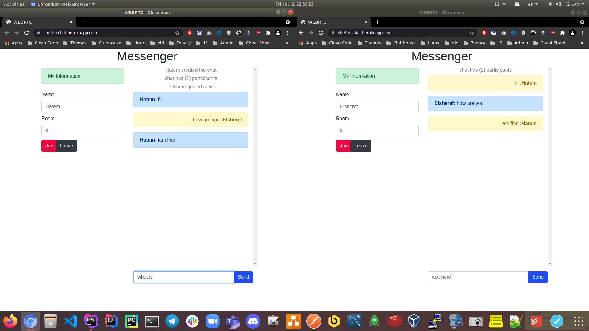

# shefoo-chat
implementation to chat with socket io support multi users and rooms

Online Demo
```
https://shefoo-chat.herokuapp.com/
```


Next version
* remove join button after join the room
* handle if the user already joined before
* hide leave before join room
* hide join while joining
* show leave after join room
* show join after leave
* don't send leave message repeatedly while clicking the button
* improve typing feature